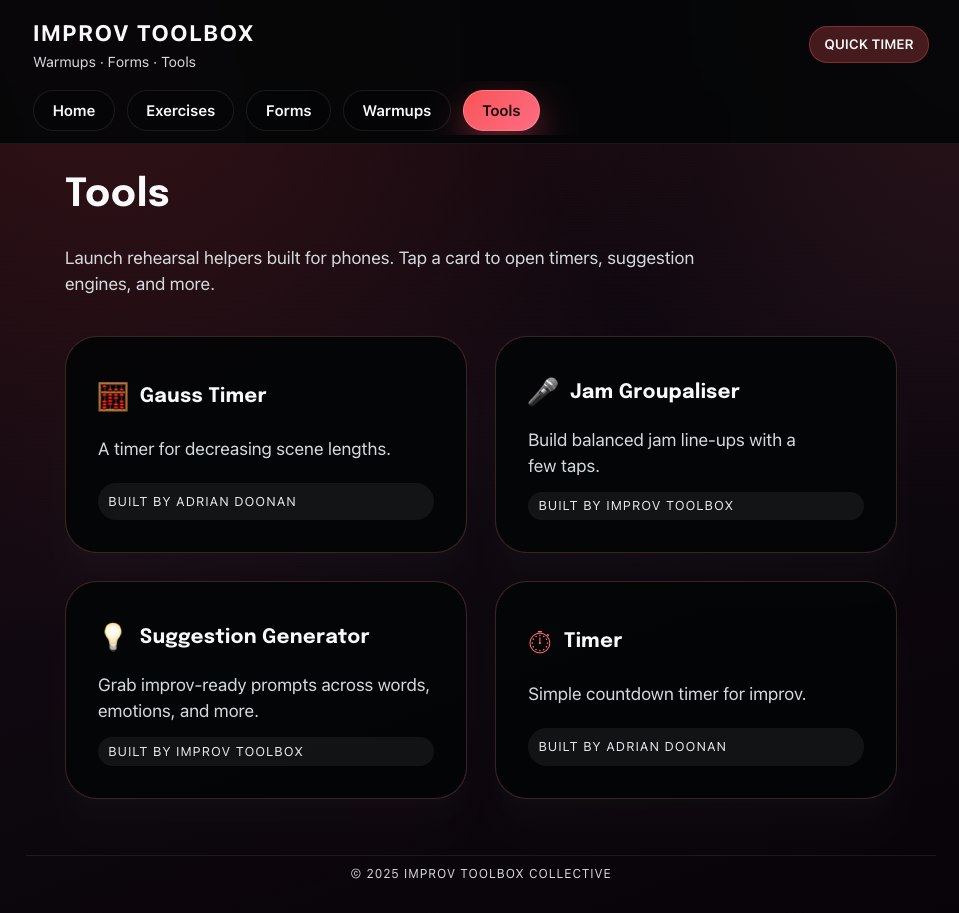

# Improv Toolbox

Improv Toolbox is a mobile-first Progressive Web App (PWA) for improv teachers and players. It provides timers, suggestions, and a pocket database of exercises, forms, and warmups, all optimized for quick use on phones and tablets.

## Features

- **Main navigation drawer** with instant access to Home, Exercises, Forms, Warmups, and Tools.
- **Landing page** hero cards that preview every collection and highlight sample content.
- **Tools directory** with dedicated pages for Timer, Gauss Timer, Jam Groupaliser, and Suggestion Generator.
- **Exercises, forms, and warmups** content collections with weighted fuzzy search, structured filters, rich metadata, and generated detail pages.
- **Favorites filters** so recurring go-to items surface quickly across the listings ([exercises index](src/pages/exercises/index.astro)).
- **Personal notes** panels on every detail page so coaches can jot Markdown snippets per item ([NotesPanel](src/components/NotesPanel.astro)).
- **Lesson Planner tool** for sequencing warmups, exercises, and breaks into reusable sessions ([lesson plans](src/pages/tools/lesson-plans/index.astro)).
- **PWA shell** that ships a dark theme, offline-friendly build, and install prompts for mobile devices.
- **Mobile quick actions** that surface shortcuts to the Timer, Warmups, and Exercises right from the home screen.

## Getting Started

1. Install dependencies:
   ```sh
   npm install
   ```
2. Start the development server:
   ```sh
   npm run dev
   ```
3. Build for production:
   ```sh
   npm run build
   ```
4. Preview your build:
   ```sh
   npm run preview
   ```

## Testing

Build and validate the static HTML output before committing:

```sh
npm test
```

The test runner performs an Astro production build, then inspects key pages in `dist/` to verify navigation links, category cards, tool listings, and exercise filters.

## Documentation & Assets

- [Architecture](docs/architecture.md) — build, runtime, and deployment overview
- [Requirements](docs/requirements.md) — product scope and delivery status
- [Outline](docs/outline.md) — feature summaries and backlog
- [API](docs/api.md) — data contracts (work in progress)

Tools page preview:



## Project Structure

- `public/` — Static assets, icons, and styles
- `src/components/` — Reusable UI components (e.g., Drawer)
- `src/layouts/` — Main layout files
- `src/pages/` — All routes, including tools, exercises, forms, and warmups

## Tech Stack

- [Astro](https://astro.build/) — Static site generator
- [Pico.css](https://picocss.com/) — Minimal CSS framework
- Plain JavaScript for all interactivity

## Author

Adrian Doonan

---

For more details, see the code and explore the app!
